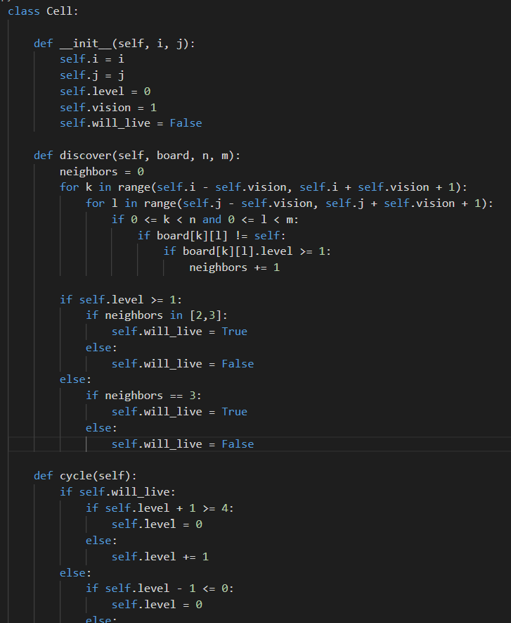
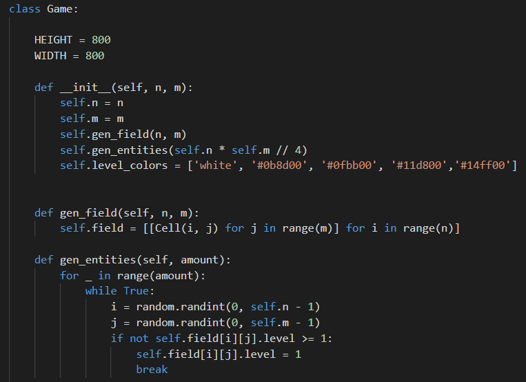
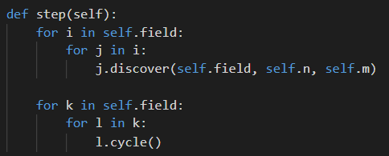
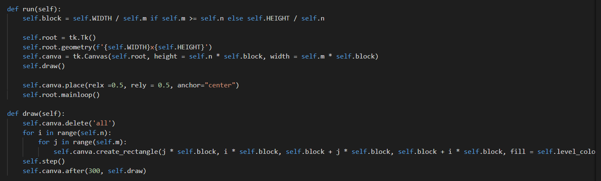

# Leveling
As a reference i used Conway's Game of life. The idea of this game is simulate life on the 2d matrix board using special rules below
Rules:
1. Live cell dies if it has less than 2 neighbors and more than 3 neighbors. Dead cell will be alive if it has 3 alive cell nearby
2. After every cycle cell's level decrease or increase if level more than 4 cell will dies

## Code

Cell class:

this class has two methods 'discover' and 'cycle'. 'discover' method will count how many alive heighbors it has. 'cycle' - method will execute verdict which controled by level_up argument

Game class:

Game class is main class will control everything in game and displays out results of every cycle using 'tkinter' library for python. It has two constants 'HEIGHT' and 'WIDTH' of window. It takes two arguments 'n' and 'm' to create fied. Field creates by using 'gen_fields' method and summons first live cells

Step method:

This method will go though the field and fist call 'discover' method of Cell after 'cycle' method of Cell

Rendering part:

To dispay all results there was created draw and run methods. 'run' methods is used to start game, also here creates Tkinter window with canva. 'draw' methods it one of the main methods, here is witten speed of simulation and how it will be look like.